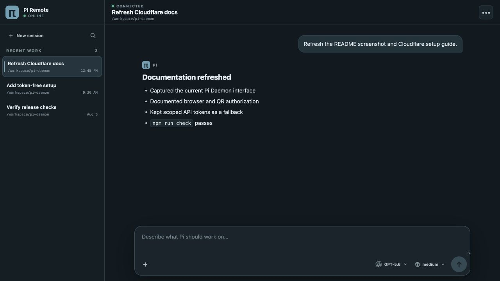
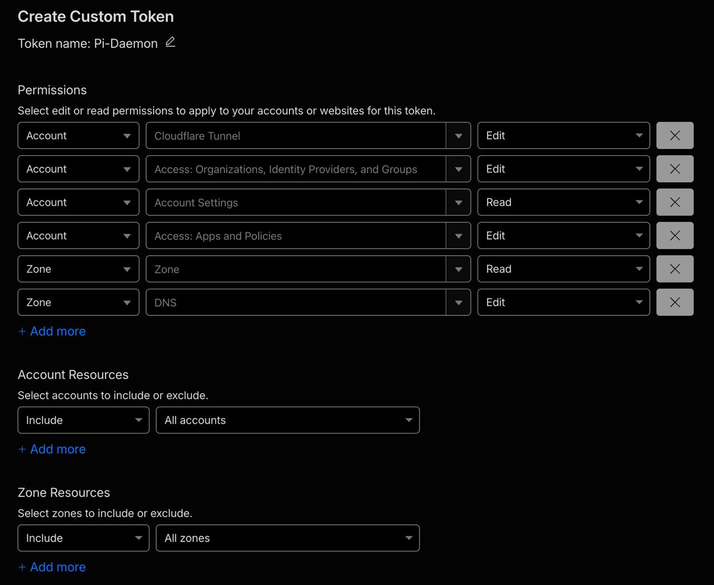

# Pi Daemon

Pi Daemon runs the [Pi coding agent](https://github.com/earendil-works/pi) in a persistent server session, serves a focused mobile PWA on loopback, and publishes it through a named Cloudflare Tunnel protected by an exact-email Access policy.



> **Security:** An authenticated mobile user can invoke Pi's coding tools, execute commands, and modify files without per-action confirmation. Use a dedicated Cloudflare hostname, protect the email account used for OTP, and do not run the service on a machine you are unwilling to control remotely.

## One-line installation

```sh
curl -fsSL https://github.com/SASUKE40/pi-daemon/releases/latest/download/install.sh | sh
```

Prerequisites:

- `curl` and `tar` (the installer provides its own Node.js 22.19.0/npm runtime without root)
- macOS 13+ on arm64/x64, or glibc Linux arm64/x64
- A Cloudflare-managed DNS zone and a scoped API token

The wizard installs the checksummed Pi Daemon web package from the GitHub release, Node.js `22.19.0`, Pi `0.84.1`, cloudflared `2026.7.3`, and three user-level services. Before installing, it checks for compatible Node.js/npm, Pi, and Pi Daemon commands and reuses each one it finds instead of reinstalling it; when Node.js is missing or too old, it provides a managed runtime without root. Cloudflare and Pi provider setup then run interactively on the board; on a headless board, open the displayed browser links on another device and paste the resulting scoped Cloudflare API token into the hidden terminal prompt. Invalid or under-scoped tokens can be replaced without restarting setup. The wizard asks whether to save the setup choices and API token in a mode-0600 local file for future setup or reinstall, defaulting to Yes; answer No to discard the token after setup. A saved token is verified again before every reuse. The tunnel connector token is saved separately in a mode-0600 file and passed to cloudflared with `--token-file`, never on the process command line.

## Architecture

```text
Mobile PWA ── Cloudflare Access ── Tunnel ── 127.0.0.1:8504 web gateway
                                                        │ mode-0600 Unix socket
                                                        ▼
                                              long-lived Pi session daemon
                                                        │
                                              ~/.pi/agent sessions/auth
```

Closing the browser or restarting the web gateway does not stop the Pi run. Restarting the session daemon or rebooting necessarily terminates an in-flight model/tool call, but the append-only session remains resumable. V1 keeps multiple saved sessions and permits one active run globally.

On macOS the components run as LaunchAgents; on Linux they run as systemd user services. The release is web-only and does not ship Electron or desktop-control tooling.

## Commands

```text
pi-daemon setup
pi-daemon status
pi-daemon doctor
pi-daemon logs [sessiond|web|tunnel|all]
pi-daemon restart [sessiond|web|tunnel|all]
pi-daemon update
pi-daemon uninstall
pi-daemon uninstall --delete-cloudflare
```

The default uninstall removes only Pi Daemon services and runtime configuration. It preserves `~/.pi/agent` authentication and sessions and leaves Cloudflare resources intact. If reinstall choices were saved, uninstall asks whether to preserve or forget them; preserving them makes the next setup reuse the directory, hostname, email, account, and zone and offer the saved API token. Deleting Cloudflare resources requires the explicit flag, confirmation, and a freshly entered API token.

## Cloudflare API token permissions

If a Cloudflare API token has been exposed, **immediately revoke the exposed token** under **Cloudflare > My Profile > API Tokens**. Do not reuse or retry an exposed token.

Choose **Create Custom Token**, scope it to one account and one DNS zone, and add:

- Account > Account Settings > Read
- Account > Cloudflare Tunnel > Edit/Write
- Account > Access: Apps and Policies > Edit/Write
- Account > Access: Organizations, Identity Providers, and Groups > Edit/Write
- Zone > Zone > Read
- Zone > DNS > Edit/Write



_Permission-row example. For least privilege, do not leave **All accounts** or **All zones** selected; use the specific resource scopes below._

Set the token's resource scopes explicitly:

- Account Resources > Include > the account owning the domain
- Zone Resources > Include > the intended DNS zone

This scoped API token is required because `cloudflared`'s browser login cannot configure the Access application and exact-email policy. The setup wizard asks before saving it to the reinstall memo, with Yes as the default. The memo is plaintext JSON protected by owner-only file permissions, so answer No on an untrusted or shared user account; revoke the token if the host is compromised.

The wizard creates or validates one remotely managed tunnel, one proxied CNAME, one self-hosted Access application, and an Allow policy containing the exact email plus a required One-time PIN login method. It refuses to overwrite conflicting DNS or Access resources.

## Completion notifications

Pi Daemon can send an opt-in Web Push notification when a session completes or fails, even when the PWA is closed. Open **Completion notifications** from the session header and enable alerts separately on each device. Disabling alerts removes only that device's subscription.

On iPhone and iPad, first add Pi Daemon to the Home Screen, open the installed app, and then enable notifications from the in-app control, as required by [WebKit's Web Push support](https://webkit.org/blog/13878/web-push-for-web-apps-on-ios-and-ipados/). Android and desktop browsers can enable notifications directly when their Push API support is available. The Pi Daemon host needs outbound HTTPS access to the browser vendor's push service; no additional inbound port or Cloudflare resource is required.

Completion notifications include up to 160 characters from the final assistant response, and failure notifications include the error message. This preview may be visible on the device lock screen. Web Push subscriptions and the private VAPID key are stored under Pi Daemon's mode-0700 data directory in mode-0600 files and are removed with the normal Pi Daemon data uninstall.

## Development

```sh
npm install
npm run check
```

For local testing, create `~/.config/pi-daemon/config.json` or run the setup wizard, start `npm run dev:sessiond`, then run the built web server. The server always binds to `127.0.0.1`; loopback requests are allowed without Cloudflare, while requests using the configured public Host must carry a valid `Cf-Access-Jwt-Assertion`.

Tagged releases build the web package on Ubuntu, attach it directly to the GitHub release, mirror the pinned Node.js and cloudflared assets, and publish SHA-256 checksums plus the installer. No Apple or npm publishing credentials are required.

## Operational notes

- Prevent system sleep separately if the machine must remain reachable; Pi Daemon does not change power-management settings.
- If a tunnel token is exposed, rotate it in Cloudflare before starting the connector.
- Existing system/root cloudflared services are not modified; Pi Daemon installs a separate user connector.
- If outbound traffic is restricted, allow the push-service endpoints returned by subscribed browsers (including `*.push.apple.com` for Apple devices).
